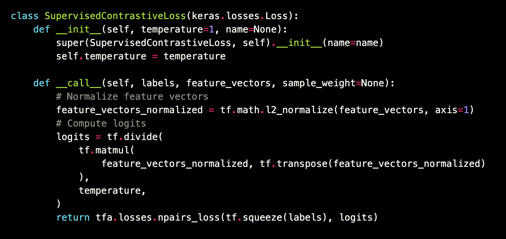

# Contrastive Learning

## Dependencies
```bash
pip install tensorflow-addons
```

## Contrastive Loss
<p float="left">
    
</p>

## Result

## References
* https://arxiv.org/abs/2004.11362
* https://keras.io/examples/vision/supervised-contrastive-learning
* https://www.tensorflow.org/api_docs/python/tf/keras/losses/Loss
* https://www.tensorflow.org/addons/api_docs/python/tfa/losses/npairs_loss
* https://www.tensorflow.org/api_docs/python/tf/squeeze