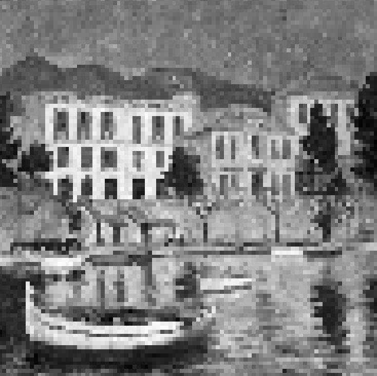
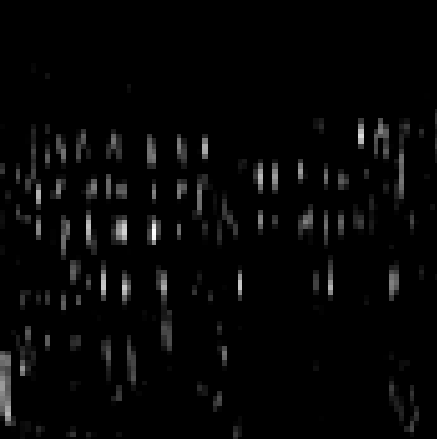
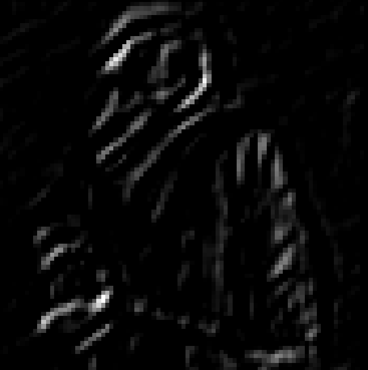

# Edge detection

## Canny Edge Detector

    

## HOG

    

## CNN

### Model

The CNN model trained to classify portraits and landscapes reaches 0.96 test accuracy with:
* Training data: 13000 landscapes + 13000 portraits (0.2 validation split)
* Test data: 2000 landscapes + 2000 portraits

    
    

### Filter

The filter of the second convolutional layer is shown below:

    

### Activation

The activations of filter index 3 and 5 of the second convolutional layer are shown below for landscape:

    
    
    

The activations of filter index 3 and 5 of the second convolutional layer are shown below for portrait:

    
    
    

## References
* https://opencv-python-tutroals.readthedocs.io/en/latest/py_tutorials/py_imgproc/py_canny/py_canny.html
* https://scikit-image.org/docs/dev/api/skimage.filters.html