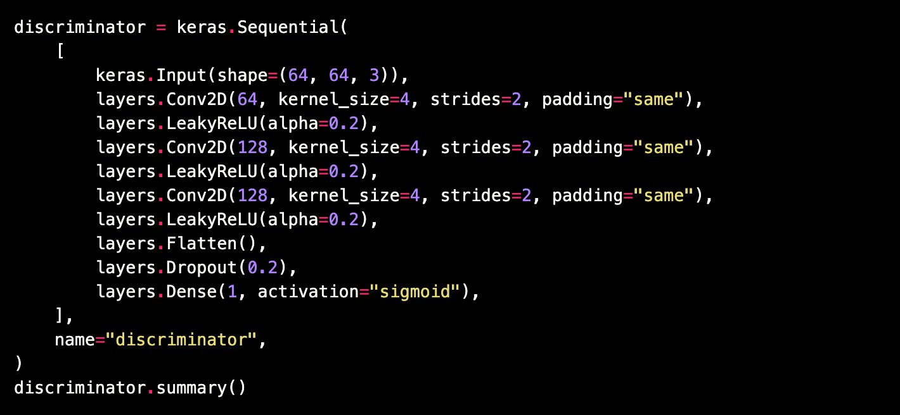
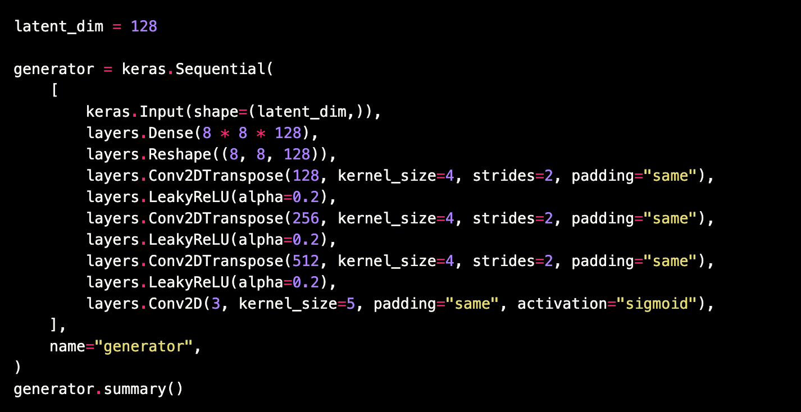
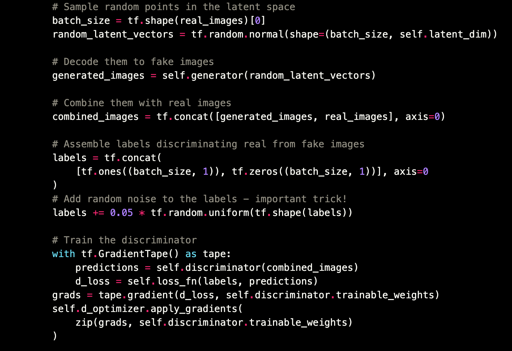
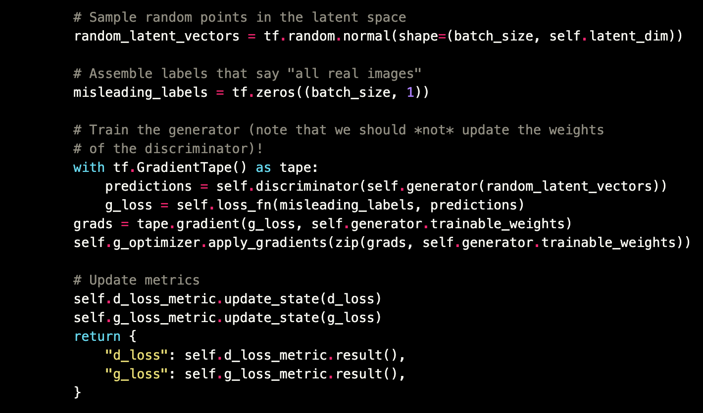

# Generative adversarial network

## Code

### Discriminator

    

### Generator

    

### Loss of Discriminator

    

### Loss of Generator

    

## References
* https://github.com/goodfeli/adversarial
* https://keras.io/examples/generative/dcgan_overriding_train_step/
* https://keras.io/examples/generative/wgan_gp/
