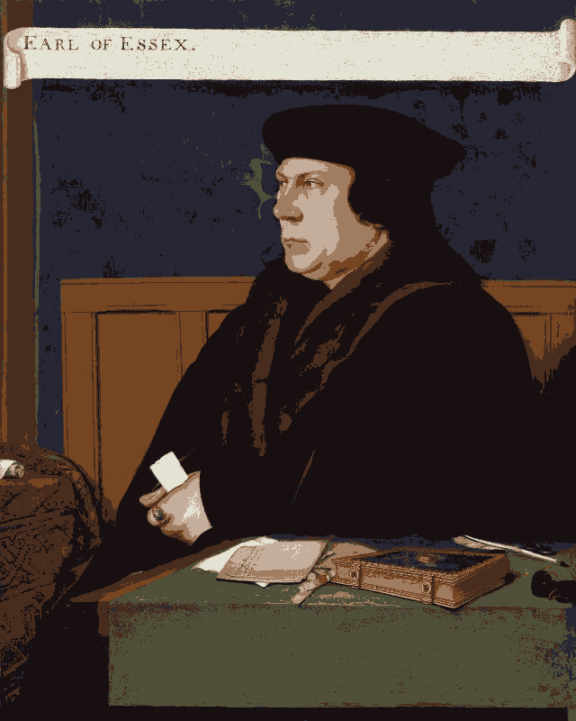
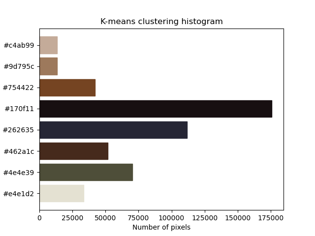
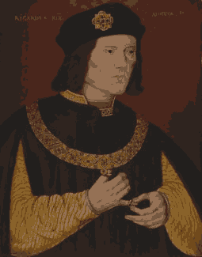
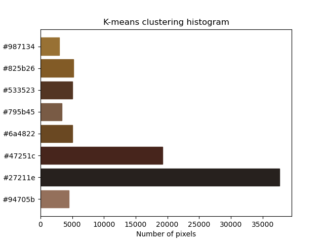

# Histogram

## Code

```
$ python hist.py
```

## Result

<p float="left">
    
    
</p>

<p float="left">
    
    
</p>

## References
* https://matplotlib.org/3.1.0/tutorials/colors/colormaps.html
* https://matplotlib.org/3.1.1/api/_as_gen/matplotlib.pyplot.pcolormesh.html
* https://matplotlib.org/3.1.1/gallery/images_contours_and_fields/pcolor_demo.html#sphx-glr-gallery-images-contours-and-fields-pcolor-demo-py
* https://matplotlib.org/3.1.1/api/_as_gen/matplotlib.pyplot.pcolor.html
* https://www.color-hex.com/color/473223
* https://www.color-hex.com/color-wheel/
* https://htmlcolorcodes.com/resources/best-color-palette-generators/
* https://blog.templatetoaster.com/color-palette-generators/
* http://paletton.com/#uid=10O0u0kge8V9EiI9UaZl77dqw4X
* https://galactic.ink/sphere/
* https://colorbrewer2.org/#type=sequential&scheme=BuGn&n=3
* https://matplotlib.org/3.1.1/tutorials/colors/colormaps.html
* https://www.learnopencv.com/histogram-of-oriented-gradients/
* https://docs.opencv.org/master/da/df5/tutorial_py_sift_intro.html