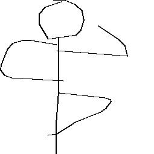
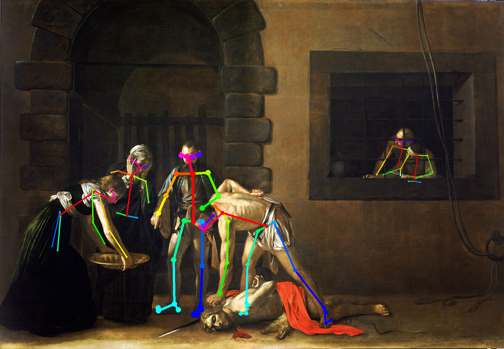
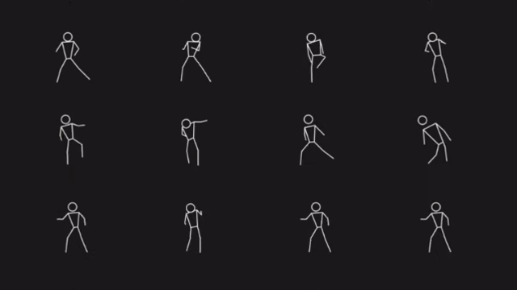
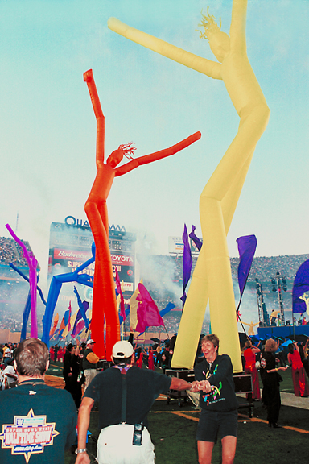
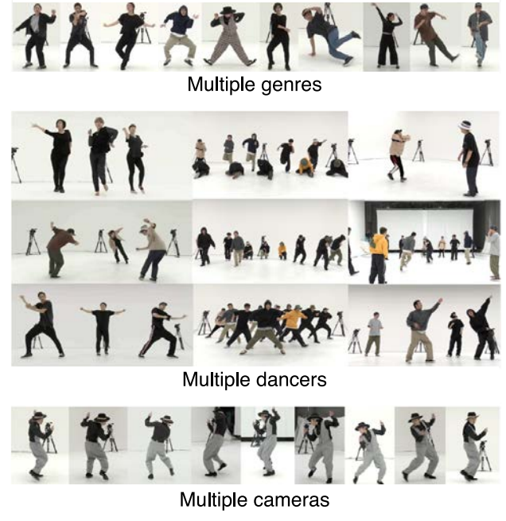

# Pose

## Sources

* [Google Quick Draw](https://github.com/googlecreativelab/quickdraw-dataset), [Facebook DensePose (Mesh?)](https://github.com/facebookresearch/DensePose), [CMU OpenPose (Armature? Stick figure?)](https://github.com/CMU-Perceptual-Computing-Lab/openpose)

	
	
	

* [Choreography](https://experiments.withgoogle.com/living-archive-wayne-mcgregor), [Sky Dancer](https://en.wikipedia.org/wiki/Tube_man
), [AIST Dance Video Database](https://aistdancedb.ongaaccel.jp/)

	
	
	

## References
* https://quickdraw.readthedocs.io/en/latest/
* https://en.wikipedia.org/wiki/Peter_Minshall
* https://en.wikipedia.org/wiki/Doron_Gazit
* https://aistdancedb.ongaaccel.jp/
* http://homepages.inf.ed.ac.uk/rbf/CVonline/Imagedbase.htm
* http://homepages.inf.ed.ac.uk/rbf/CVonline/Imagedbase.htm#rgbd
* http://homepages.inf.ed.ac.uk/rbf/CVonline/Imagedbase.htm#human
