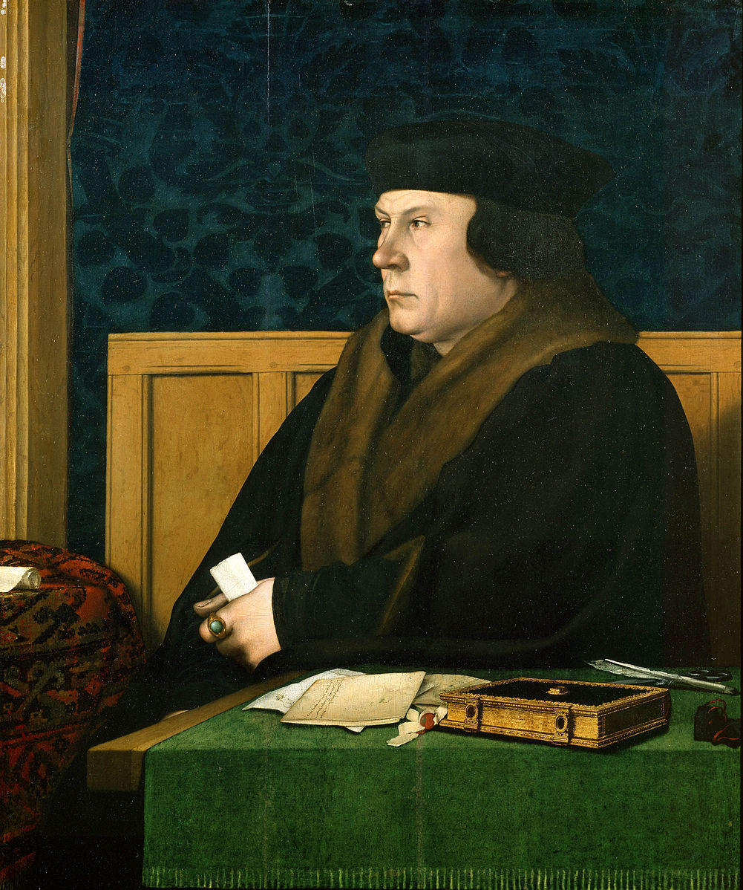
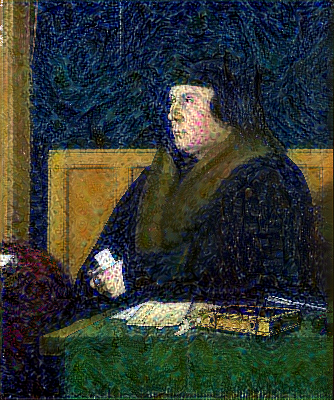

# Style transfer

## Result

    
    

## Todos

- [ ] Customize loss function - Recap
- [ ] Optimization function
- [ ] Loss layer
- [ ] Conv2DTranspose
- [ ] Tensorflow
- [ ] Genetic algorithm
- [ ] Reinforcement learning - Recap
- [ ] Self-supervised learning
- [ ] Optical flow - Recap
- [ ] Fourier transform - Recap

## References
* https://keras.io/examples/
