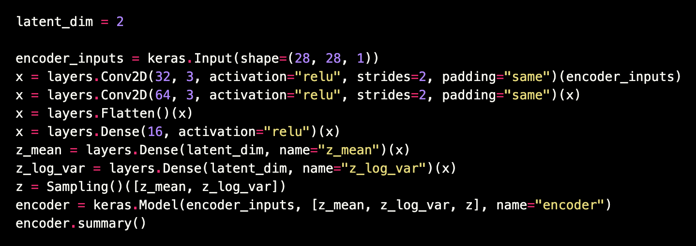
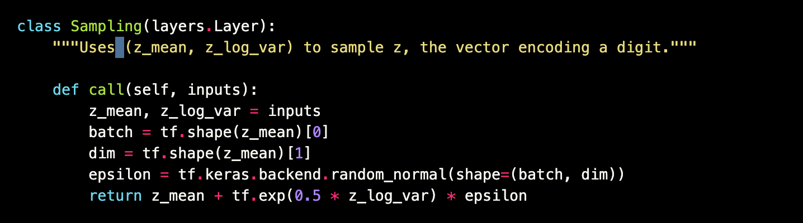
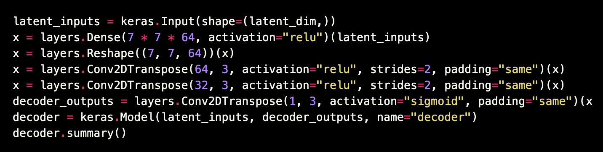
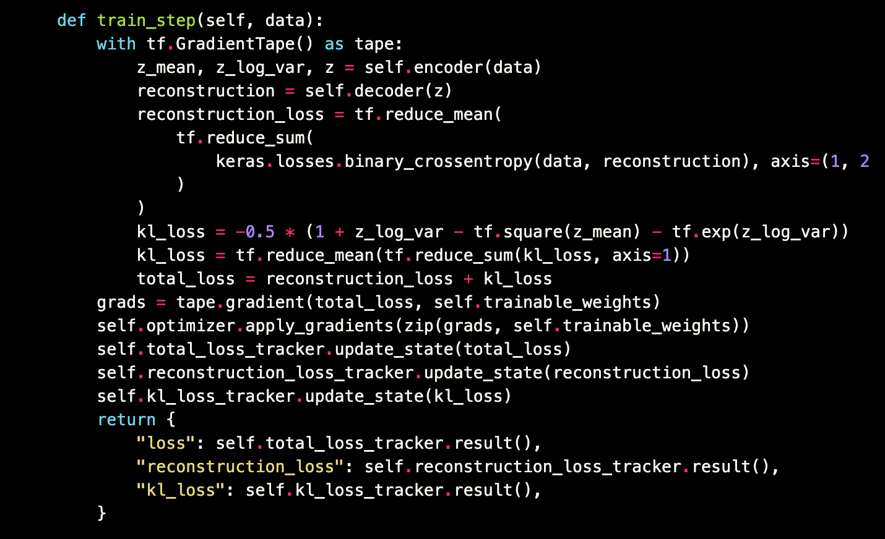

# VAE, t-SNE or PCA

## Code

### Encoder

<p float="left">
    
</p>

### Sampling layer

<p float="left">
    
</p>

### Decoder

<p float="left">
    
</p>

### Loss

<p float="left">
    
</p>

## Result

<p float="left">
    
</p>

## Todos

 - [ ] Develop latent spaces of sound and music

## Issues

* [NotFoundError: No algorithm worked! when using Conv2D](https://github.com/tensorflow/tensorflow/issues/43174)

```python
from tensorflow.compat.v1 import ConfigProto
from tensorflow.compat.v1 import InteractiveSession

config = ConfigProto()
config.gpu_options.allow_growth = True
session = InteractiveSession(config=config)
```

## References
* https://keras.io/examples/generative/vae/
* https://ermongroup.github.io/cs228-notes/extras/vae/
* https://lvdmaaten.github.io/tsne/
* https://scikit-learn.org/stable/modules/generated/sklearn.manifold.TSNE.html
* https://towardsdatascience.com/visualising-high-dimensional-datasets-using-pca-and-t-sne-in-python-8ef87e7915b