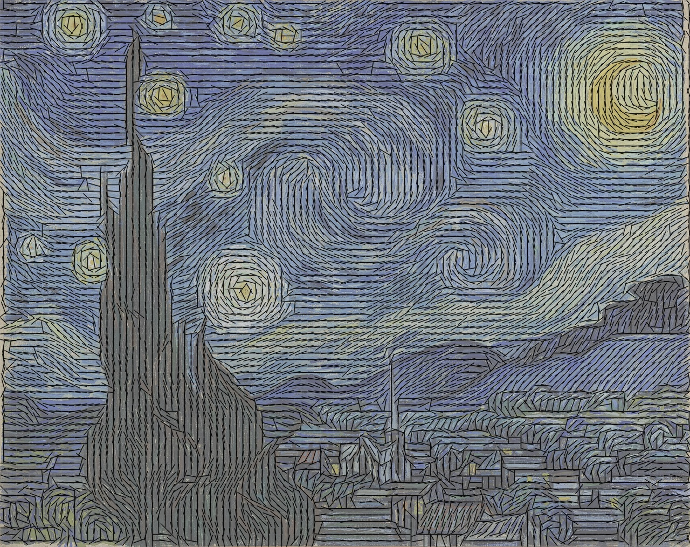

# Wavelet

## Method

### Local Motion Signal

It is possible to compute the local motion signals using other techniques. For example, classical **optical flow** and **point correlation** methods were successfully used in previous work on visual vibration sensing.
* [New image processing tools for structural dynamic monitoring](https://oatao.univ-toulouse.fr/1739/)
* [Uncertainty analysis of high frequency image-based vibration measurements](https://www.sciencedirect.com/science/article/pii/S0263224113001863)

    

The local motion signals can also be derived from **phase variations** in the complex **steerable pyramid** proposed by [Simoncelli et al. 1992; Portilla and Simoncelli 2000]. 
* [A Parametric Texture Model based on Joint Statistics of Complex Wavelet Coefficients](http://www.cns.nyu.edu/pub/lcv/portilla99.pdf)
* [The Heeger & Bergen Pyramid Based Texture Synthesis Algorithm](http://www.ipol.im/pub/art/2014/79/)
* [Python3 Implementation of steerable pyramid](https://github.com/TetsuyaOdaka/SteerablePyramid/)

For small motions, these **phase variations** are approximately proportional to **displacements** of image structures along the corresponding **orientation** and **scale**.

### 1D Motion Signal

These local motion signals are aligned and averaged into a single, 1D motion signal that captures global movement of the object over time. 

## References
* http://people.csail.mit.edu/mrub/VisualMic/
* https://github.com/TetsuyaOdaka/SteerablePyramid/
* https://github.com/opencv/opencv/tree/master/samples/python
* https://opencv-python-tutroals.readthedocs.io/en/latest/py_tutorials/py_video/py_lucas_kanade/py_lucas_kanade.html
* https://en.wikipedia.org/wiki/The_Starry_Night
* http://home.messiah.edu/~barrett/mpg/mpg.html
* https://nl.mathworks.com/help/signal/ref/pwelch.html
* https://nl.mathworks.com/matlabcentral/fileexchange/3805-rational-fraction-polynomial-method
